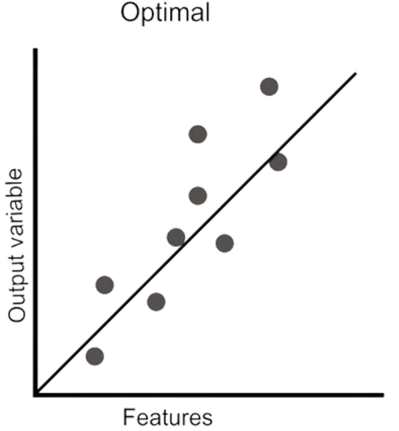
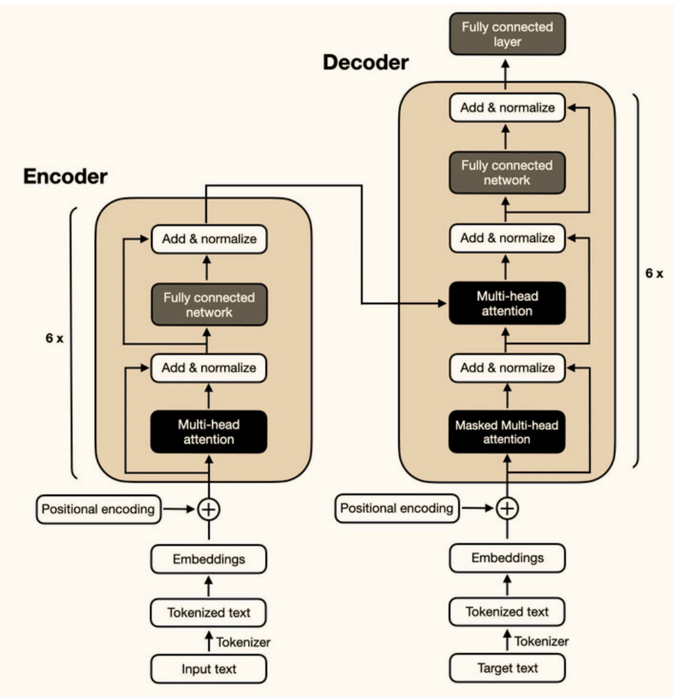

# 1. **Tokenization**? Why **important** in **LLMs?**

Tokenization is process of

- splitting text into smaller units called tokens, which can be

  - words
  - subwords
  - characters

- For instance
  - **_tokenization_** might be broken down into smaller subwords like **_token_** & **_ization_**

Why

- Because LLMs

  - do not understand raw text directly
  - Instead process sequences of numbers that represent these tokens

- Effective tokenization allows models to

  - handle various languages
  - manage rare words
  - reduce vocabulary size

  which improves both efficiency & performance

# 2. **LoRA** & **QLoRA?**

Techniques designed to optimize finetuning LLMs

- focus on

  - reducing memory usage
  - enhancing efficiency

- without compromising performance NLP tasks

## **LoRA (Low-Rank Adaptation)**

A parameter-efficient fine-tuning method that

- introduces new trainable parameters

  - to modify a model's behavior
  - without increasing its overall size

- LoRA

  - Maintain original parameter count
  - Reduce memory overhead
    - typically associated with training large models

- Works by adding low-rank matrix adaptations to model's existing layers

  - allow significant performance improvements
  - while keeping resource consumption in check

- Ideal for environments where
  - computational resources limited
  - yet high model accuracy still required

## **QLoRA (Quantized LoRA)**

Build on LoRA

- by incorporating quantization
- to further optimize memory usage

Use techniques

- 4-bit Normal Float
- Double Quantization
- Paged Optimizers

to

- compress model's parameters
- improve computational efficiency

Reduce precision of model weights

- e.g, from 16-bit to 4-bit
- while retain most of model's accuracy
- allow fine-tune LLMs with minimal memory footprint

Useful when scaling large models

- maintains performance levels comparable to full-precision models
- while significantly reducing resource consumption

# 3. **Beam search**? How differ from **greedy decoding**?

A search algorithm

- used during text generation
- to find most likely sequence of words

Instead of choosing single highest-probability word at each step (greedy decoding), beam search

- explore multiple possible sequences in parallel
- maintain a set of top k candidates (beams)

It balances between

- finding high-probability sequences
- exploring alternative paths

Lead to more coherent & contextually appropriate outputs, especially in long-form text generation tasks

# 4. Concept of **temperature** in LLM

Temperature is a hyperparameter that

- controls randomness of text generation
- by adjusting probability distribution over possible next tokens

A low temperature (close to 0)

- makes model highly deterministic
- favoring most probable tokens

A high temperature (above 1)

- encourages more diversity by flattening distribution
- allowing less probable tokens to be selected

In short

- Low - Deterministic
- Medium - Balanced
- High - Diverse

For instance, a temperature of 0.7 strikes a balance between creativity & coherence, making it suitable for generating diverse but sensible outputs

# 5. **Masked language modeling**? How it **contribute** to **model pretraining**?

MLM is a training objective

- where some tokens in input are randomly masked
- model is tasked with predicting them based on context

This forces model to

- learn contextual relationships between words
- enhance its ability to understand language semantics

Commonly used in models like BERT

- which pretrained using this objective to develop a deep understanding of language before fine-tuning on specific tasks

# 6. **Sequence-to-Sequence Models**

Seq2Seq

- a type of NN architecture designed to transform one sequence of data into another sequence

- Commonly used in tasks where input & output have variable lengths

  - machine translation
  - text summarization
  - speech recognition

# 7. How do **autoregressive models** differ from **masked models** in LLM training?

Autoregressive models

- such as GPT
- generate text one token at a time
- with each token predicted based on previously generated tokens
- This sequential approach is ideal for tasks like text generation

Masked models

- like BERT
- predict randomly masked tokens within a sentence
- leveraging both left & right context

Summary

- Autoregressive models excel in generative tasks
- Masked models better for understanding & classification tasks

# 8. **Embeddings** role in LLMs? How they initialized?

Embeddings

- dense, continuous vector representations of tokens
- capture semantic & syntactic information

Map discrete tokens (words/subwords) into a high-dimensional space

- making them suitable for input into neural networks

Typically initialized

- randomly or
- with pretrained vectors like Word2Vec or GloVe

During training, these embeddings are finetuned to capture task-specific nuances, enhancing model's performance on various language tasks

# 9. **Next sentence prediction**? How **useful** in **language modeling?**

NSP

- a key technique used in language modeling
- particularly in training large models like BERT (Bidirectional Encoder Representations from Transformers)
- helps a model understand relationship between 2 sentences
  - important for tasks
    - question answering
    - dialogue generation
    - & information retrieval

During pre-training, model is fed 2 sentences

- 50% of time, second sentence is **actual** next sentence in document (positive pairs)
- 50% of time, second sentence is a **random** sentence from corpus (negative pairs)

Model is trained to classify whether second sentence is correct next sentence or not

- This binary classification task is used alongside a masked language modeling task to improve model's overall language understanding

# 10. Difference between **top-k** & **nucleus (top-p)** sampling in LLMs

Top-k sampling

- restricts model's choices to top k most probable tokens at each step
- introducing controlled randomness
- for example
  - `k=10` means model will only consider 10 most likely tokens

Nucleus (top-p) sampling

- takes a more dynamic approach
- select tokens whose cumulative probability exceeds a threshold p (e.g, 0.9)
- allows for flexible candidate sets based on context, promoting both diversity & coherence in generated text

# 11. How **prompt engineering** influence output of LLMs?

Prompt engineering

- craft input prompts to guide an LLM's output effectively
- Since LLMs are highly sensitive to input phrasing, a well-designed prompt can significantly influence quality & relevance of response

For example

- adding context or specific instructions within prompt can improve accuracy in tasks like summarization or question-answering

Useful in zero-shot & few-shot learning scenarios

- where task-specific examples are minimal

# 12. How can **catastrophic forgetting** be **mitigated** in LLMs?

Catastrophic forgetting

- happens when an LLM forgets previously learned tasks while learning new ones,
- which limits its versatility

Strategies to mitigate

1. **Rehearsal methods**

   - These involve retraining model on a mix of old & new data
   - helping it retain knowledge of previous tasks

1. **Elastic Weight Consolidation (EWC)**

   - Assign importance to certain model weights
   - Protecting critical knowledge while learning new tasks

1. **Modular approaches**

   - Techniques like
     - progressive neural networks (ProgNet)
     - optimized fixed expansion layers (OFELs)
   - introduce new modules for new tasks
   - allow LLM to learn without overwriting prior knowledge

# 13. **Model distillation**? How it **applied** to LLMs?

A technique where

- a smaller, simpler model (student) is trained to replicate behavior of a larger, more complex model (teacher)
- Student model learns from teacher's soft predictions rather than hard labels, capturing nuanced knowledge

This approach

- reduces computational requirements & memory usage
- while maintaining similar performance
- make it ideal for deploying LLMs on resource-constrained devices

# 14. How LLMs handle **out-of-vocabulary (OOV) words?**

- OOV - words that model did not encounter during training

LLMs address this issue through

- subword tokenization techniques like
  - Byte-Pair Encoding (BPE)
  - WordPiece
- break down OOV words into smaller, known subword units
- For example
  - word **_unhappiness_** might be tokenized as **_un_**, **_happi_** & **_ness_**
- Allow model to understand & generate words it has never seen before by leveraging these subword components

# 15. How **Transformer** architecture overcome challenges faced by traditional **Sequence-to-Sequence** models?

- **Parallelization**

  - Seq2Seq process sequentially
    - slowing training
  - Transformers use self-attention to process tokens in parallel
    - speeding up both training + inference

- **Long-Range Dependencies**

  - Seq2Seq models struggle with longrange dependencies
  - Transformers capture these effectively with self-attention
    - Allow model to focus on any part of sequence, regardless of distance

- **Positional Encoding**

  - Transformers process entire sequence at once
    - positional encoding is used to ensure model understands token order

- **Efficiency** & **Scalability**

  - Seq2Seq
    - slower to scale due to sequential processing
  - Transformers, with their parallelism
    - scale better for large datasets & long sequences

- **Context Bottleneck**

  - Seq2Seq uses a single context vector, limiting information flow
  - Transformers let decoder attend to all encoder outputs, improving context retention

# 16. Overfitting? How to prevent?

When model

- performs well on training data
- but poorly on unseen or test data

Because model has learned

- not only underlying patterns in data
- but also noise & outliers

Make it overly complex & tailored to training set

- As a result, model fails to generalize to new data

Techniques to overcome **Overfitting**

- **Regularization (L1, L2)**

  - Adding a penalty to loss function to discourage overly complex models
    - L1 (Lasso) can help in feature selection
    - L2 (Ridge) smooths weights

- **Dropout**

  - Dropout randomly deactivates a fraction of neurons during training
    - prevent model from becoming overly reliant on specific nodes

- **Data Augmentation**

  - Expand training dataset with slight variations
    - such as flipping / rotating images
    - to make model more robust

- **Early Stopping**

  - Monitor performance of model on validation data
  - Stop training when validation loss stops decreasing

- **Simpler Models**

  - Reducing complexity of model by decreasing no. features, parameters, or layers

# 17. **Generative** & **Discriminative** models?

**Generative models**

- learn underlying data distribution & generate new samples from it
- model joint probability distribution of inputs & outputs
  - aim to maximize likelihood of observed data
- Example
  - language model predicts next word in a sequence based on previous words

**Discriminative models**

- focus on learning a decision boundary between different classes in input-output space
- model conditional probability of outputs given inputs
  - aiming to accurately classify new examples
- Example
  - sentiment analysis model classifies text as positive / negative / neutral based on its content

In short

- generative models generate new data
- discriminative models classify existing data

# 18. GPT-4 vs GPT-3 in terms of **capabilities** & **applications?**

- **Improved Understanding**
  - GPT-4: 1 trillion parameters, significantly more than
  - GPT-3: 175 billion parameters
- **Multimodal Capabilities**
  - GPT-4 processes both text & images, a major leap
  - GPT-3: text-only
- **Larger Context Window**
  - GPT-4 handle inputs with a much larger context window up to 25,000 tokens
  - GPT-3 max 4,096 tokens
- **Better Accuracy** & **Fine-Tuning**
  - GPT-4 has been fine-tuned
    - more factually accurate
    - reduce likelihood of producing false or harmful information
- **Language Support**
  - GPT-4 has improved multilingual performance up to **26 languages** with higher accuracy compared to GPT-3 in non-English

# 19. **Positional encodings** in context of LLMs?

PEs

- address inability of transformer architectures to capture sequence order
- Since transformers process tokens simultaneously through self-attention, unaware of token order
- provide necessary information to help model understand sequence of words

**Mechanism**

- Additive Approach
  - PEs are added to input word embeddings, merging static word representations with positional data
- Sinusoidal Function
  - Many LLMs, such as GPT, use trigonometric functions to generate these PEs

# 20. Multi-head attention

- An enhancement of single-head attention, allow a model to

  - attend to information from different representation subspaces simultaneously
  - focusing on various positions in data

Instead of using a single attention mechanism, multi-head attention

- projects queries, keys, values into multiple subspaces (denoted as h times) through distinct learned linear transformations

- Apply attention function in parallel to each of these projected versions of queries, keys, values
  - which generates multiple output vectors
- These outputs are then combined to produce final dv-dimensional result

- Improve capture more complex patterns & relationships in data

# 21. **Softmax function** role in **attention mechanisms**

Transforms a vector of real numbers into a probability distribution

- Input vector $x = [x_1, x_2, ..., x_n]$
- softmax function for i-th element

$$\text{softmax}(x_{i})={\frac{e^{x_{i}}}{\sum_{j=1}^{n}e^{x_{j}}}}$$

Ensures all output values lie between 0 & 1 & sum to 1

- Make them interpretable as probabilities

In attention mechanisms

- softmax is applied to attention scores to normalize them

  - allow model to assign varying levels of importance to different tokens when generating output

- help model focus on most relevant parts of input sequence

# 22. How **dot product** used in **self-attention**? Its **implications** for **computational efficiency?**

In self-attention

- dot product to calculate similarity between query (Q) & key (K) vectors
- attention scores

$$\mathrm{Attention}(Q,K,V)=\mathrm{softmax}\left(\frac{Q K^{T}}{\sqrt{d_{k}}}\right)V$$

Where $d_k$ is dimensionality of key vectors

- dot product measures alignment between tokens

  - help model decide which tokens to focus on

- While effective, quadratic complexity (O(n^2)) in sequence length can be a challenge for long sequences, prompting development of more efficient approximations

# 23. Explain **cross-entropy loss** & why commonly used in language modeling

Cross-entropy loss

- measures difference between
  - predicted probability distribution
  - true distribution (one-hot encoding of correct token)

$$L=-\sum_{i=1}^{N}y_{i}\log({\hat{y}}_{i})$$

Where

- $y_i$ is true label
- $\hat{y}_i$ is predicted probability

Cross-entropy loss

- penalizes incorrect predictions more heavily
- encouraging model to output probabilities closer to 1 for correct class

In language modeling, it ensures model predicts correct token in a sequence with high confidence

# 24. Compute **gradient** of loss function wrt. embeddings?

To compute gradient of loss L wrt. an embedding vector E, apply chain rule

$${\frac{\partial L}{\partial E}}={\frac{\partial L}{\partial{\hat{y}}}}\cdot{\frac{\partial{\hat{y}}}{\partial E}}$$

- ${\frac{\partial L}{\partial{\hat{y}}}}$ is gradient of loss wrt. output logits
- ${\frac{\partial{\hat{y}}}{\partial E}}$ is gradient of logits wrt. embeddings

Backpropagation propagates these gradients through network layers, adjusting embedding vectors to minimize loss

# 25. Role of **Jacobian matrix** in **backpropagation** through a **transformer model**?

Jacobian matrix

- represents partial derivatives of a vector-valued function wrt. its inputs

In backpropagation

- captures how each element of output vector changes wrt. each input

For transformer models, Jacobian is essential in computing gradients for multi-dimensional outputs

- ensuring that each parameter (including weights & embeddings) is updated correctly to minimize loss function

# 26. **Eigenvalues** & **eigenvectors** in **context** of **matrix factorization** for **dimensionality reduction**

- Eigenvalues & eigenvectors are fundamental in understanding structure of matrices

- Given a matrix A, an eigenvector & eigenvalue satisfy equation

$$Av = \lambda v$$

- In dimensionality reduction techniques like PCA (Principal Component Analysis), eigenvectors represent principal components, & eigenvalues indicate amount of variance captured by each component

- Selecting components with largest eigenvalues helps reduce dimensionality while preserving most of data's variance

# 27. How **KL divergence** used in evaluating LLM outputs?

KL (Kullback-Leibler) divergence

- measure difference between 2 probability distributions
  - P (true distribution)
  - Q (predicted distribution)

$$D_{K L}(P||Q)=\sum_{i}P(i)\log\frac{P(i)}{Q(i)}$$

In LLMs

- Quantify how much predicted distribution deviates from target distribution
- A lower KL divergence
  - indicates that model's predictions closely match true labels
  - useful metric in evaluating & fine-tuning language models

# 28. **Derivative** of **ReLU activation function**

ReLU (Rectified Linear Unit) function

$$f(x)=\text{max}(0,x)$$

Derivative

$$
f^{\prime}(x)=
{
\begin{cases}
1 & {\mathrm{if~}}x > 0
\\
0 & {\mathrm{if~}}x \leq 0
\end{cases}
}
$$

ReLU introduces non-linearity while maintaining computational efficiency. Its sparsity (outputting zero for negative inputs) helps mitigate vanishing gradient problem, making it a popular choice in deep learning models, including LLMs

# 29. **Chain rule** in calculus? Apply to **gradient descent** in DL?

Chain rule states that derivative of a composite function is

$${\frac{d}{d x}}f(g(x))=f^{\prime}(g(x))\cdot g^{\prime}(x)$$

In DL

- Chain rule

  - used in backpropagation
  - to compute gradients of loss function
    - wrt. each parameter layer by layer

- allows GD to

  - update weights efficiently
  - propagate error signals backward through network

# 30. **Attention scores** in **transformer**

$$\mathrm{Attention}(Q,K,V)=\mathrm{softmax}\left({\frac{Q K^{T}}{\sqrt{d_{k}}}}\right)V$$

- Q (queries), K (keys), V (values) learned representations of input
- Dot product measures similarity between queries & keys
- Scaling by prevents excessively large values, ensuring stable gradients
- Softmax function
  - normalize these scores
  - emphasize most relevant tokens for each query, guiding model's focus during generation

# 31. How Gemini's architecture optimize training efficiency & stability compared to other multimodal LLMs like GPT-4?

1. Unified Multimodal Design

   - Gemini integrates text & image processing in a single model
   - Improve parameter sharing & reducing complexity

1. Cross-Modality Attention

   - Enhanced interactions between text & images
   - lead to better learning & stability during training

1. Data-Efficient Pretraining

   - Self-supervised & contrastive learning allow Gemini to train with less labeled data, boosting efficiency

1. Balanced Objectives

   - Better synchronization of text & image losses ensures stable training & smoother convergence

# 32. Different types of **Foundation Models**

Foundation models

- large-scale AI models trained on vast amounts of unlabeled data using unsupervised methods
- designed to learn general-purpose knowledge that can be applied to various tasks across domains

1. Language Models

   - Tasks
     - machine translation
     - text summarization
     - question answering
   - Examples
     - BERT
     - GPT-3

1. Computer Vision Models

   - Tasks
     - image classification
     - object detection
     - image segmentation
   - Examples
     - ResNet
     - VGGNet

1. Generative Models

   - Tasks
     - creative writing
     - image generation
     - music composition
   - Examples
     - DALL-E
     - Imagen

1. Multimodal Models
   - Tasks
     - Image captioning
     - visual question answering
   - Examples
     - PaLM
     - LaMDA

# 33. How **Parameter-Efficient Fine-Tuning (PEFT) prevent catastrophic forgetting** in LLMs

PEFT helps prevent catastrophic forgetting in LLMs by

- updating only a small set of task-specific parameters
- while keeping most of model's original parameters frozen

This approach allows model to

- adapt to new tasks without overwriting previously learned knowledge
- ensure it retains core capabilities while learning new information efficiently

# 34. Key steps in **Retrieval-Augmented Generation (RAG)** pipeline?

1. **Retrieval**

   - query is encoded & compared with precomputed document embeddings to retrieve relevant documents

1. **Ranking**

   - retrieved documents are ranked based on their relevance to query

1. **Generation**

   - top-ranked documents are used as context by LLM to generate more informed & accurate responses

This hybrid approach enhances model's ability to produce context-aware outputs by incorporating external knowledge during generation

# 35. How **Mixture of Experts (MoE)** technique improve LLM scalability?

MoE improves LLM scalability by

- using a gating function
- to activate only a subset of expert models (sub-networks) for each input, rather than entire model

This selective activation

- Reduces computational load
  - only a few experts are active per query
  - minimize resource usage
- Maintains high performance
  - model dynamically selects most relevant experts for each input
  - ensure task complexity is handled effectively

MoE

- enable efficient scaling of LLMs
- allow larger models with billions of parameters while controlling computational costs

# 36. **Chain-of-Thought (CoT)** prompting?How it improve complex reasoning in LLMs?

CoT prompting helps LLMs handle complex reasoning by encouraging them to break down tasks into smaller, sequential steps

- Simulating human-like reasoning
  - CoT prompts model to approach problems step-by-step
  - similar to how humans solve complex issues
- Enhancing multi-step task performance
  - Effective for tasks involving logical reasoning or multi-step calculations
- Increasing accuracy
  - By guiding model through a structured thought process, CoT reduces errors & improves performance on intricate queries

CoT

- improves LLMs'
  - interpretability
  - reliability
- in tasks that require deeper
  - reasoning
  - decision-making

# 37. Difference between **Discriminative** AI & **Generative** AI

## **Predictive / Discriminative** AI

- Focus on predicting or classifying data based on existing data
- Models conditional probability

  $$P(y|x)P(y|x)P(y|x)$$

  - y - target variable
  - x - input features

Examples

- classification (e.g. image recognition)
- regression (e.g. predicting stock prices)
- applications such as
  - spam detection
  - disease diagnosis

## **Generative** AI

- Focus on generating new data samples that resemble training data
- Models joint probability

  $$P(x,y)P(x, y)P(x,y)$$

- Allow it to create new instances of data

Examples

- generating text, images, music & other content

Techniques

- Generative Adversarial Networks (GANs)
- Variational Autoencoders (VAEs)
- Large language models (LLMs)

# 38. How knowledge graph integration enhance LLMs?

Integrating knowledge graphs with LLMs enhances performance by adding structured, factual knowledge

- **Factual accuracy**
  - model can cross-check information against knowledge graph
  - reduce hallucinations & improving correctness
- **Enhanced reasoning**
  - Knowledge graphs support logical reasoning by leveraging relationships between entities
  - enable better handling of complex queries
- **Contextual understanding**
  - Structured data helps model understand context & relationships
  - improve response quality

Valuable in tasks

- question answering
- entity recognition
- recommendation systems

where structured knowledge plays a critical role

# 39. **Zero-shot learning**? Apply to LLMs?

Zero-shot learning

- enables LLMs to perform tasks they haven't been explicitly trained for
- by leveraging their broad understanding of language & general concepts

Instead of needing task-specific finetuning

- model can generate relevant outputs based on instructions provided in prompt

Examples

- **Text classification**
  - Categorize text without specific training, simply by understanding prompt's context
- **Translation** or **summarization**
  - Translate or summarize text using provided instructions, even without task-specific finetuning

This shows LLMs' ability to generalize across tasks, making them versatile for various applications

# 40. How **Adaptive Softmax** speed up LLMs?

Adaptive Softmax accelerates LLMs by

- categorizing words into frequency groups
- allowing for fewer computations for infrequent words

This approach

- lower overall computational costs while preserving accuracy
- effective for efficiently managing large vocabularies

# 41. **Vanishing gradient problem**? How **Transformer architecture** address it?

Vanishing gradient occurs when

- gradients diminish during backpropagation
- prevent deep networks from learning effectively
  - especially in models like RNNs that handle long sequences

Transformers address this by

- **Self-Attention Mechanism**
  - Captures relationships between all tokens in a sequence simultaneously
  - avoid sequential dependencies & prevent gradient shrinkage over time
- **Residual Connections**
  - Skip connections between layers allow gradients to flow directly
  - ensure they remain strong throughout backpropagation
- **Layer Normalization**
  - Normalizes inputs within each layer
  - stabilize gradient updates & prevent vanishing or exploding gradients

These enable deep models to learn efficiently

- even for long sequences
- overcome limitations of earlier architectures

# 42. **Few-shot learning** in LLMs

Ability of model to understand & tackle new tasks with just a few examples

- Possible by model's extensive pre-training
- Allow it to generalize from limited data

Main benefits of few-shot learning

- **Reduced Data Needs**
  - Require fewer examples to perform well
  - minimize need for large, task-specific datasets
- **Increased Flexibility**
  - Easily adapt to various tasks with minimal additional training
- **Cost Efficiency**
  - Less need for extensive data & reduced training times
  - Lower costs associated with data collection & computational resources
- **Interpretability**
  - It can be challenging to understand & explain how LLMs make their decisions due to their complex & often opaque nature
- **Data Privacy**
  - Training on large datasets can raise concerns about data privacy & security
- **Cost**
  - Developing, training & deploying LLMs can be costly, which may limit their use for smaller organizations

# 43. LLM generating **offensive** or **factually incorrect** outputs. How to diagnose & address this issue?

If an LLM produces offensive or inaccurate outputs

- analyze patterns
- check input prompts
- assess if issue stems from biases or gaps in training data
- review preprocessing pipeline for errors or biases & examine dataset for imbalances
- evaluate model's architecture, hyperparameters & fine-tuning to identify any structural issues

Solutions could include

- adversarial training
- debiasing
- data augmentation
- retraining with a more balanced dataset

# 44. Encoder / Decoder

- Encoder
  - process input data
  - transform it into a set of abstract representations
- Decoder then
  - take these representations & generates output
  - using both information from encoder & previously generated elements in sequence

Short

- Encoder - understand input
- Decoder - producing final output

# 45. Main differences between LLMs & traditional statistical language models?

- **Architecture**
  - LLMs are based on transformers with self-attention
    - captures long-range dependencies
    - unlike traditional models like N-grams or HMMs struggle with this
- **Scale**
  - LLMs have billions of parameters & train on massive datasets, enabling better generalization
  - Traditional models smaller & task-specific
- **Training**
  - LLMs undergo unsupervised pre-training & finetuning
  - Traditional models rely on supervised learning with labeled data for each task
- **Input**
  - LLMs handle variable-length inputs using advanced tokenization like BPE
  - Traditional models often use fixed-length inputs & simpler tokenization
- **Context**
  - LLMs generate contextual embeddings, adapting to word meaning based on context
  - Traditional models use static embeddings
- **Flexibility**
  - LLMs can tackle multiple NLP tasks with little finetuning
  - Traditional models designed for specific tasks
- **Resources**
  - LLMs demand high computational power, requiring GPUs or TPUs
  - Traditional models more lightweight

# 46. Context window

- Span of text measured in tokens or words
  - that model can process at any given moment when generating or interpreting language
- influence on model's ability to produce coherent & contextually relevant responses

A larger context window means

- model can incorporate more surrounding information
- enhances its understanding & ability to generate text
  - particularly in more complex or extended interactions

However, increasing context window also raises computational demands

- Trade-off between improved performance & resource efficiency

# 47. Hyperparameter

Parameter set before training process begins & influences how model is trained

- Control aspects of training process
- chosen by developer or researcher based on prior knowledge or experimentation

Examples

- model's architecture
- batch size
- regularization strength
- learning rate

More specific examples

- Train-test split ratio
- Learning rate in optimization algorithms (e.g, gradient descent)
- Choice of optimization algorithm (e.g, gradient descent, stochastic gradient descent, Adam optimizer)
- Choice of activation function in a NN layer (e.g, Sigmoid, ReLU, Tanh)

# 48. Attention mechanisms in transformer

- Attention allows model to focus on different parts of input sequence when making predictions
- Instead of treating every word or token equally
  - model learns to "attend" to relevant words that contribute most to current prediction
    - regardless of their position in sequence

For example

- **_The dog chased ball because it was fast_**
- word **_it_** could refer to either dog or ball
- attention mechanism helps model figure out that
  - **_it_** is likely referring to **_the ball_** based on context

# 49. Large Language Models

AI system

- trained on vast amounts of text to understand, generate & predict human-like language
- learns patterns, context & relationships in data to produce relevant, coherent responses

Wide range of tasks

- answer questions
- summarize text
- perform translation
- creative writing

Their ability to generalize across different language tasks

- come from training on diverse datasets
- allow to generate contextually appropriate & meaningful content based on input

# 50. Common challenges using LLMs

- **Computational Resources**
  - Require substantial computing power & memory
    - make both training & deployment demanding
- **Bias** & **Fairness**
  - LLMs might learn & reproduce biases from their training data
    - potentially leading to biased or unfair outputs
- **Interpretability**
  - Can be challenging to understand & explain how LLMs make their decisions due to their complex & often opaque nature
- **Data Privacy**
  - Training on large datasets can raise concerns about data privacy & security
- **Cost**
  - Developing, training, & deploying LLMs can be costly, which may limit their use for smaller organizations
